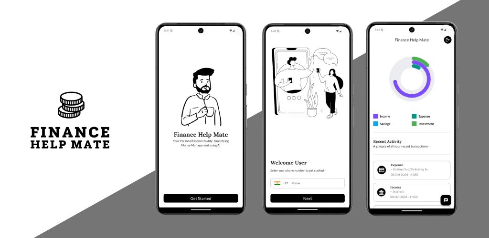
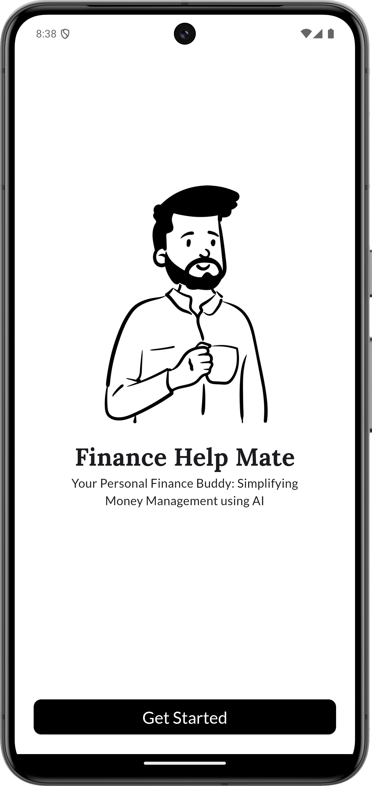
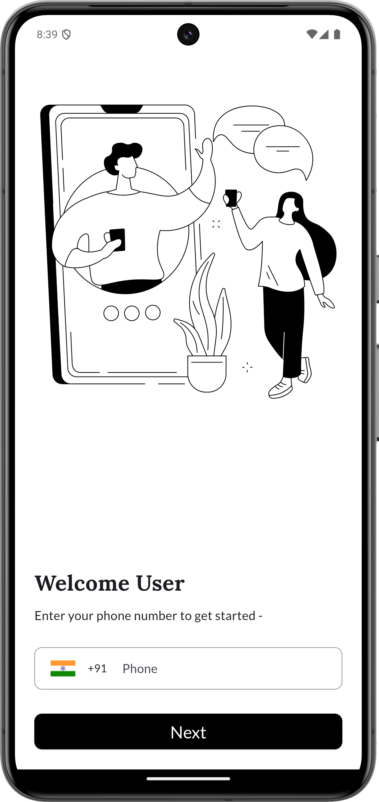
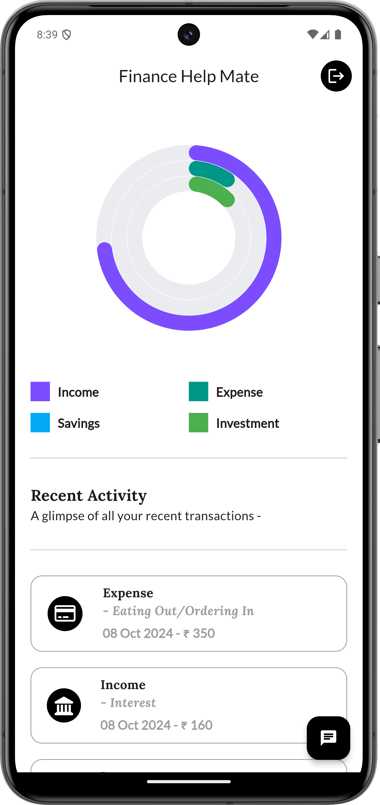
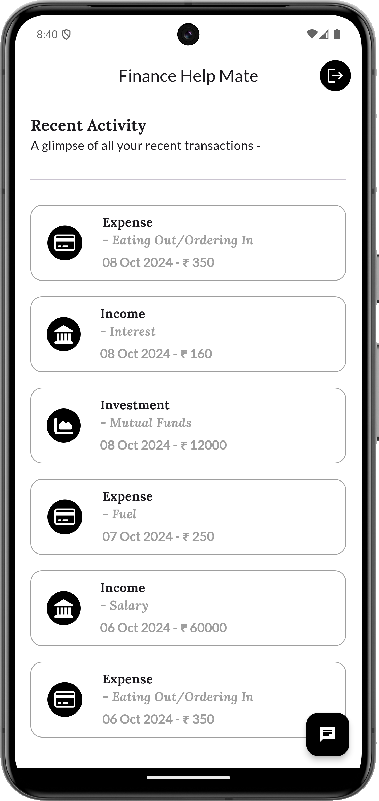
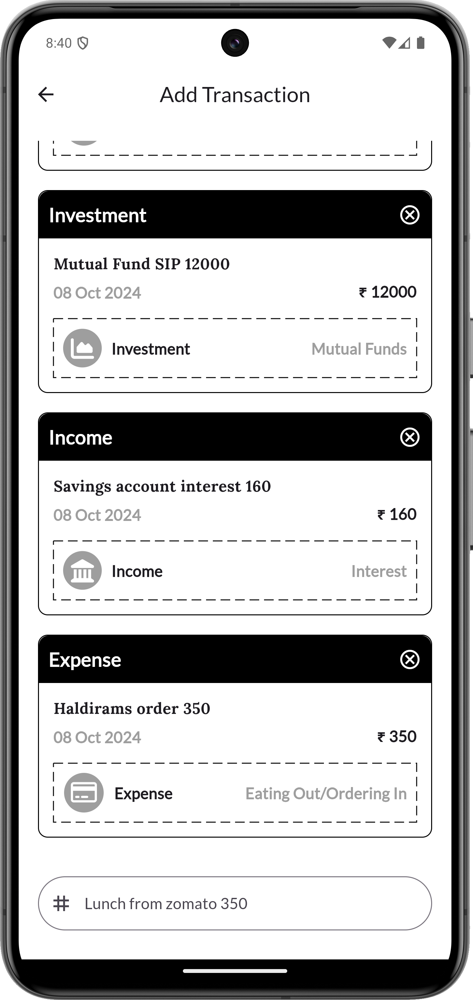

<p align="center">
  
</p>

# Finance Help Mate

<p align="center">
  <strong>Your Personal Finance Buddy: Simplifying Money Management using AI</strong>
</p>

<p align="center">
  <a href="https://flutter.dev"></a>
  <a href="https://dart.dev"></a>
  <a href="https://riverpod.dev"></a>
  <a href="https://pub.dev/packages/hive_flutter"></a>
  <a href="https://github.com/masanthimanshu/finance_help_mate"></a>
  <a href="https://github.com/masanthimanshu/finance_help_mate"></a>
</p>

---

## What the Project Does

**Finance Help Mate** is a cross-platform mobile application designed to remove the friction of personal finance tracking. Instead of forcing users to fill out complex multi-field expense forms, Finance Help Mate lets users log income and expenses through **conversational natural language** (e.g., *"Lunch from zomato 350"* or *"Salary credited 75000"*).

The application processes user inputs, automatically extracts financial values, categorizes transactions into four core financial pillars (**Income**, **Expense**, **Savings**, and **Investment**), and presents intuitive visual insights through interactive charts and real-time activity feeds.

---

## App Previews

<div align="center">
  <table>
    <tr>
      <td align="center" width="20%">
        
        <br />
        <sub><b>Get Started</b></sub>
      </td>
      <td align="center" width="20%">
        
        <br />
        <sub><b>Phone & OTP Auth</b></sub>
      </td>
      <td align="center" width="20%">
        
        <br />
        <sub><b>Visual Dashboard</b></sub>
      </td>
      <td align="center" width="20%">
        
        <br />
        <sub><b>Conversational Entry</b></sub>
      </td>
      <td align="center" width="20%">
        
        <br />
        <sub><b>Recent Activities</b></sub>
      </td>
    </tr>
  </table>
</div>

---

## Why the Project is Useful (Key Features)

- 💬 **Conversational Natural Language Logging**: Log spending as simply as sending a chat message. Say goodbye to manual category pickers and tedious input forms.
- 🤖 **Smart Category Classification**: Automatically organizes every entry into **Income**, **Expense**, **Savings**, or **Investment**, along with detailed sub-categories.
- 📊 **Interactive Radial Charts**: Real-time spending overview powered by Syncfusion radial bar charts, giving immediate visibility into budget allocations.
- 📜 **Recent Activity Feed**: Clean chronological list of all recent transactions with icon indicators, formatted dates, and rupee values.
- 🔐 **Phone & OTP Authentication**: Quick onboarding using international phone numbers, country code selection, and 6-digit OTP verification.
- 🔄 **Resilient Networking & Token Auto-Refresh**: Dio HTTP client equipped with custom interceptors that automatically handle JWT token refreshes upon expiration without disrupting user experience.
- ⚡ **Fast Local Persistence**: Session state and tokens are securely stored locally via lightweight, high-performance Hive storage.
- 🧱 **Predictable State Architecture**: Powered by Flutter Riverpod for scalable, testable, and reactive state management.

---

## Example Usage: Conversational Inputs

Simply type what you spent or earned in the transaction input:

| What You Type | Parsed Amount | Category | Subcategory |
| :--- | :--- | :--- | :--- |
| `"Lunch from zomato 350"` | ₹350 | **Expense** | Food & Dining |
| `"Monthly salary credited 75000"` | ₹75,000 | **Income** | Salary |
| `"SIP mutual fund investment 5000"` | ₹5,000 | **Investment** | Mutual Funds |
| `"Emergency fund deposit 10000"` | ₹10,000 | **Savings** | Emergency Fund |
| `"Uber ride to office 220"` | ₹220 | **Expense** | Transport |

---

## Architecture & Project Structure

The project follows a clean, modular architecture separating UI views, business controllers, reactive state providers, models, and network infrastructure:

```
lib/
├── components/          # Reusable UI widgets (HomeChart, ChatCard, RecentActivityCard, AuthWrapper)
├── controller/          # Business logic handlers (AuthController, ChatController)
├── extras/              # Utility helpers (chart colors, FontAwesome icon mappings)
├── model/               # Immutable data models (ChatModel, ChartModel)
├── network/             # Dio HTTP client, API endpoints, and token refresh interceptor
├── provider/            # Riverpod StateNotifier providers (allChatProvider, chartDataProvider)
├── root/                # Root navigation controller and token validation guard
├── style/               # Design tokens, typography styles, and input decorations
├── utils/               # App routing table, theme configuration, and input validators
├── view/                # Application screens
│   ├── auth/            # Phone authentication and OTP verification screens
│   ├── chat/            # Conversational transaction entry screen
│   ├── get_started/     # Onboarding landing screen
│   ├── home/            # Main dashboard screen with chart and activity list
│   └── splash/          # Startup splash screen
└── main.dart            # App entry point (Hive initialization, ProviderScope, orientation lock)
```

---

## How Users Can Get Started

### Prerequisites

Ensure you have the following installed on your development machine:

- [Flutter SDK](https://docs.flutter.dev/get-started/install) (`^3.5.2` or later)
- [Dart SDK](https://dart.dev/get-dart) (`^3.5.2` or later)
- [Android Studio](https://developer.android.com/studio) (for Android development) / [Xcode](https://developer.apple.com/xcode/) (for iOS development)
- An active Android Emulator, iOS Simulator, or connected physical device

### Installation & Setup

1. **Clone the Repository**:
   ```bash
   git clone https://github.com/masanthimanshu/finance_help_mate.git
   cd finance_help_mate
   ```

2. **Install Dependencies**:
   ```bash
   flutter pub get
   ```

3. **Verify Development Environment**:
   ```bash
   flutter doctor
   ```

4. **Run the Application**:
   ```bash
   flutter run
   ```

### Code Quality & Testing

Run static analysis to verify code health:

```bash
# Run Flutter lint analysis
flutter analyze

# Format Dart code across the project
dart format .
```

---

## Tech Stack & Dependencies

| Category | Technology | Purpose |
| :--- | :--- | :--- |
| **Framework** | [Flutter](https://flutter.dev) | Cross-platform UI toolkit for iOS and Android |
| **Language** | [Dart](https://dart.dev) | Strongly-typed client-optimized language |
| **State Management** | [flutter_riverpod](https://pub.dev/packages/flutter_riverpod) | Declarative, compile-safe state management |
| **Local Storage** | [hive_flutter](https://pub.dev/packages/hive_flutter) | Fast, lightweight NoSQL key-value store for session tokens |
| **Networking** | [dio](https://pub.dev/packages/dio) | HTTP client with interceptors for automatic JWT refreshes |
| **Data Visualization**| [syncfusion_flutter_charts](https://pub.dev/packages/syncfusion_flutter_charts) | Smooth radial bar charts for financial distribution |
| **Typography & Icons**| [google_fonts](https://pub.dev/packages/google_fonts), [font_awesome_flutter](https://pub.dev/packages/font_awesome_flutter) | Lato font styling and category icon pack |
| **UI Components** | [pin_code_fields](https://pub.dev/packages/pin_code_fields), [country_code_picker](https://pub.dev/packages/country_code_picker), [dotted_border](https://pub.dev/packages/dotted_border) | Custom OTP inputs, country code selector, dashed card borders |
| **Localization** | [intl](https://pub.dev/packages/intl) | Date formatting and localized numbers |

---

## Where Users Can Get Help

- **Bug Reports & Feature Requests**: Open an issue on GitHub at [Issues](https://github.com/masanthimanshu/finance_help_mate/issues).
- **Official Documentation**:
  - [Flutter Documentation](https://docs.flutter.dev)
  - [Riverpod Documentation](https://riverpod.dev)
  - [Syncfusion Flutter Charts](https://help.syncfusion.com/flutter/cartesian-charts/overview)

---

## Maintainers and Contributing

### Maintainer

Developed and maintained by:
- **Himanshu Masant** — [GitHub (@masanthimanshu)](https://github.com/masanthimanshu) | [Email](mailto:masanthimanshu@gmail.com)

### Contributing

Contributions, feature suggestions, and bug fixes are welcome!

1. Fork the repository.
2. Create your feature branch (`git checkout -b feature/amazing-feature`).
3. Commit your changes (`git commit -m 'feat: add amazing feature'`).
4. Ensure static checks pass (`flutter analyze` and `dart format --set-exit-if-changed .`).
5. Push to the branch (`git push origin feature/amazing-feature`).
6. Open a Pull Request.
